# 글로벌 OTT 스트리밍 트렌드 분석

| 항목 | 내용 |
|------|------|
| 이름 / 학번 | 장우진 / 20221662 |
| 데이터 출처 | TMDB API (themoviedb.org) |
| 라이선스 | CC BY-NC 4.0 |

---

## 1. 문제 정의

Netflix·Disney+·Amazon Prime Video 3대 OTT 플랫폼의 콘텐츠 데이터를 분석해 플랫폼별 전략 차이와 K-콘텐츠의 글로벌 위상을 파악하고, 콘텐츠 메타데이터로 IMDB 평점을 예측한다.

| 분석 질문 | 방법 |
|-----------|------|
| 플랫폼별 콘텐츠 전략 차이는? | 장르·유형·연도별 분포 비교 (EDA + 시장 분석) |
| K-콘텐츠의 글로벌 위상은? | 편수·점유율·평점 추이 분석 |
| 메타데이터로 평점 예측 가능한가? | RandomForest·XGBoost·선형 회귀 3모델 비교 |

- **분석 대상**: Netflix · Disney+ · Amazon Prime Video — 총 **3,046편**
- **예측 목표(target)**: `imdb_rating` — 플랫폼·장르·유형·연도·런타임으로 예측하는 **연속형 회귀**

---

## 2. 데이터 소개 & EDA

### 2-1. 데이터 구조

| 컬럼 | 타입 | 설명 |
|------|------|------|
| `platform` | 범주형 | Netflix / Disney+ / Amazon Prime Video |
| `type` | 범주형 | Movie / TV Show |
| `primary_genre` | 범주형 | Drama, Action, Comedy 등 |
| `country` | 범주형 | 제작 국가 |
| `release_year` | 정수 | 출시 연도 |
| `duration_minutes` | 실수 | 런타임 (분) — 결측 18.3% |
| `imdb_rating` | 실수 | IMDB 평점 (0~10점) |

### 2-2. 결측값 분석

`duration_minutes` 결측률이 **18.3%** 로 가장 높다. TV 시리즈는 에피소드별 런타임을 TMDB API가 제공하지 않는 **구조적 결측**이다.

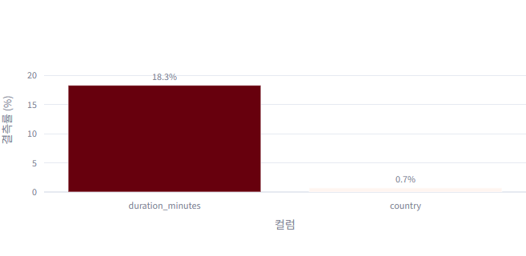

| 컬럼 | 결측률 | 처리 방법 |
|------|--------|-----------|
| `duration_minutes` | 18.3% | 장르 평균값 대체 + `duration_missing` 플래그 추가 |
| `imdb_rating` | 일부 | ML 학습 시 해당 행 제외 |
| 런타임 250분 초과 | 이상치 | ML 학습 전 정상 범위만 사용 |

### 2-3. 이상치 확인

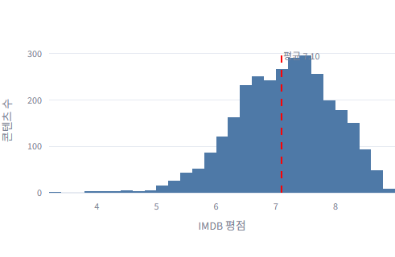

평점은 **6~8점 구간에 집중**되는 분포이며, 2점 미만 극단 이상치는 투표 수가 매우 적은 비주류 콘텐츠로 ML 학습 시 제외했다.

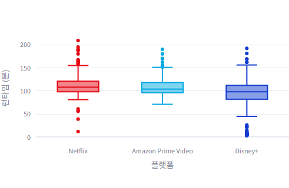

Disney+는 런타임 분포가 좁고 안정적(Pixar·Marvel IP 비중 높음). Amazon Prime Video에서 250분 이상 극단 이상치가 다수 확인된다.

### 2-4. 연도별 콘텐츠 분포

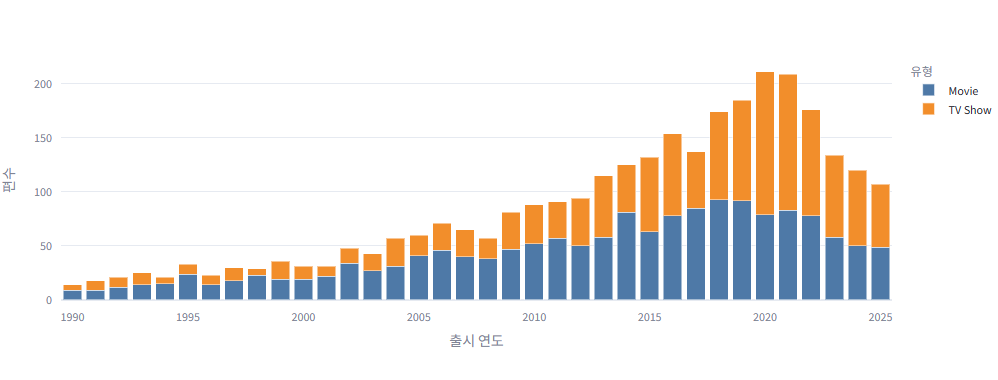

**2015년을 기점으로 TV 시리즈 비중이 급격히 증가**한다. 넷플릭스 오리지널 시리즈 투자 확대와 맞물려 OTT 플랫폼들이 드라마 시리즈 전쟁에 돌입했음을 데이터로 확인할 수 있다.

---

## 3. 특성 엔지니어링

원본 컬럼을 그대로 사용하지 않고 **가공·결합·도출**해 파생 특성 3개를 생성했다.

| 파생 특성 | 도출 방법 | 활용 목적 |
|-----------|-----------|-----------|
| `duration_missing` | `duration_minutes` 결측 여부 → 0/1 이진 플래그 | ML 입력 특성 — TV/영화 유형을 간접 반영 |
| `share_pct` | K-콘텐츠 편수 ÷ 전체 편수 × 100 | 연도별 K-콘텐츠 글로벌 점유율 시각화 |
| `period` | 출시 연도 → 5년 구간 그룹화 | 플랫폼별 장르 전략 변화 시각화 |

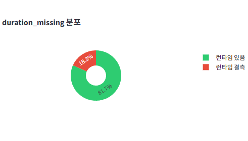

`duration_missing = 1` 콘텐츠의 대부분이 TV 시리즈임을 교차 분석으로 확인했다. 이 플래그 하나가 콘텐츠 유형 정보를 간접적으로 담아 ML Feature Importance **상위권에 위치**한다.

---

## 4. 모델 / 서비스

### 4-1. 분석 흐름

```
입력: platform · genre · type · release_year · duration_minutes
              ↓
  LabelEncoding + duration_missing 파생 특성 추가
              ↓
  RandomForest / XGBoost / LinearRegression
              ↓
출력: 예상 IMDB 평점 (0 ~ 10점)
```

### 4-2. 3모델 성능 비교

| 모델 | MAE ↓ | RMSE ↓ | R² ↑ | 비고 |
|------|-------|--------|------|------|
| 선형 회귀 | 0.538 | 0.682 | 0.328 | Baseline |
| **랜덤 포레스트** | **0.513** | **0.652** | **0.385** | **최종 선택** |
| XGBoost | 0.536 | 0.690 | 0.313 | |

랜덤 포레스트가 MAE·R² 두 지표 모두에서 가장 우수해 최종 예측 모델로 선택했다.

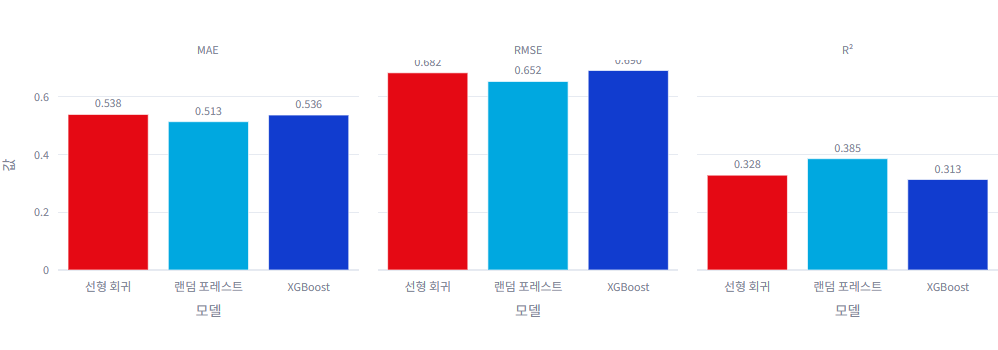

### 4-3. Feature Importance

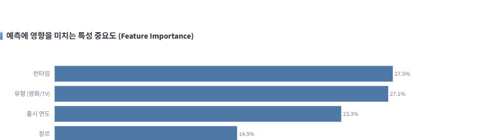

| 순위 | 특성 | 해석 |
|------|------|------|
| 1위 | `duration_missing` | TV/영화 유형 간접 반영 — 구조적 결측 패턴 |
| 2위 | `release_year` | 최근 콘텐츠일수록 평점 분포 특성이 다름 |
| 3위~ | `platform`, `genre` | 플랫폼·장르보다 구조적 특성의 예측력이 높음 |

### 4-4. 하이퍼파라미터 탐색

`n_estimators` = 50·100·200·300 으로 비교한 결과, **200에서 성능 수렴** — 300 이상은 성능 향상 없이 학습 시간만 증가한다.

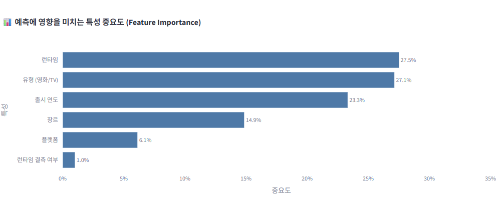

---

## 5. Streamlit 앱

### 앱 구성

| 페이지 | 주요 내용 | 차트 수 |
|--------|-----------|---------|
| 🏠 홈 | 플랫폼별 현황 요약 · 분포 차트 | 2 |
| 📊 EDA | 결측·이상치·분포 탐색 · 파생 특성 | 5 |
| 📈 시장 분석 | 연도별 트렌드 · 장르 순위 변천 · 3파전 비교 · 세계지도 | 7 |
| 🇰🇷 K-콘텐츠 | 편수·점유율 성장 · 글로벌 평점 비교 | 2 |
| 🤖 ML 예측기 | 3모델 비교 · Feature Importance · 인터랙티브 예측기 | 3 |
| 📝 결론 & 한계 | 핵심 발견 · 데이터 한계 · 향후 과제 | — |

```bash
pip install -r requirements.txt
streamlit run ott_storyboard.py
```

### 5-1. 홈

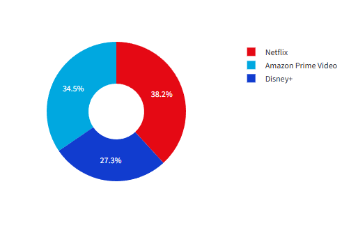

Netflix가 편수 기준 가장 큰 비중을 차지하며, Amazon Prime Video·Disney+가 뒤를 잇는다.

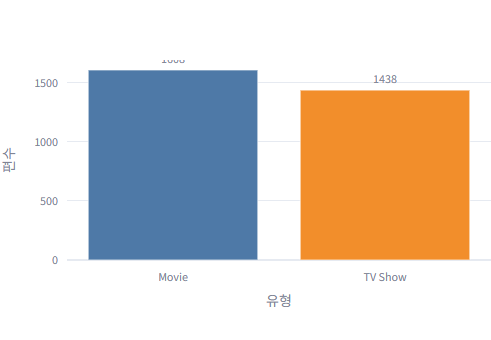

전체적으로 영화가 TV 시리즈보다 많으나, 플랫폼에 따라 비율 차이가 있다.

### 5-2. 시장 분석

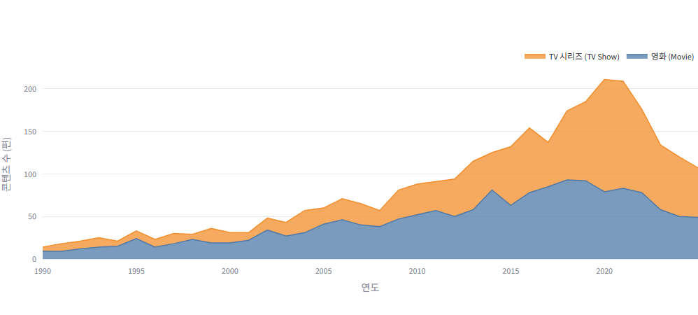

2015년 이후 가파른 성장세 — COVID-19(2020) 시점에 TV 시리즈 업로드가 정점을 찍었다.

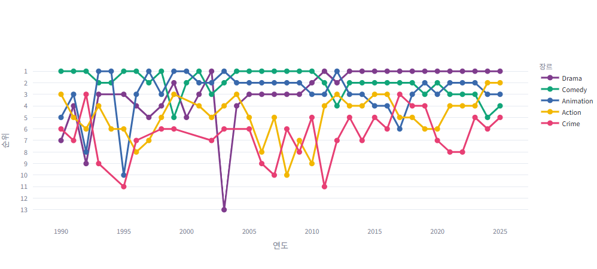

Drama는 꾸준히 1위를 유지하며, Thriller·Documentary가 최근 상승세다.

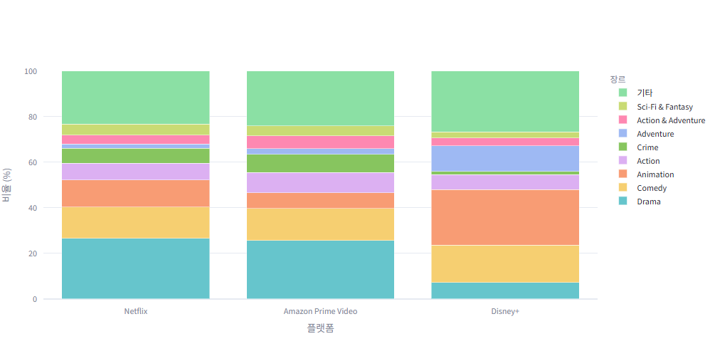

Disney+는 Animation·Family 비중이 타 플랫폼 대비 압도적으로 높아 차별화된 IP 전략을 확인할 수 있다.

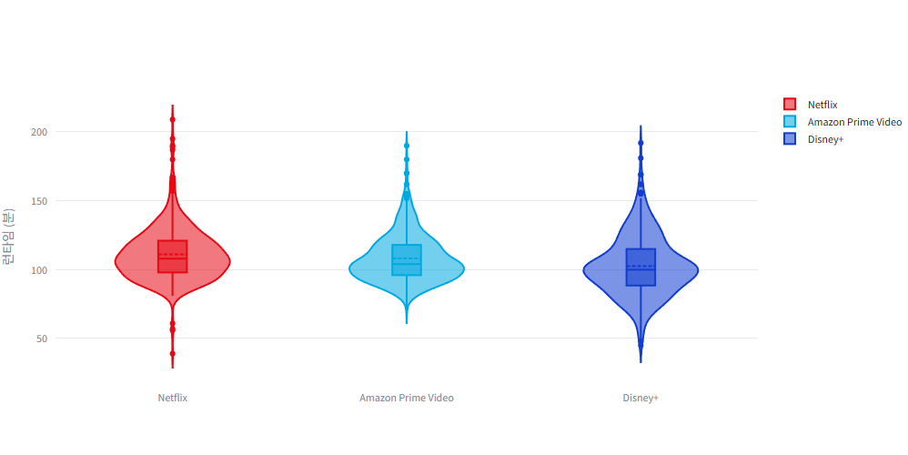

Netflix는 90~120분에 집중, Amazon은 런타임 분포가 더 넓고 이상치가 많다.

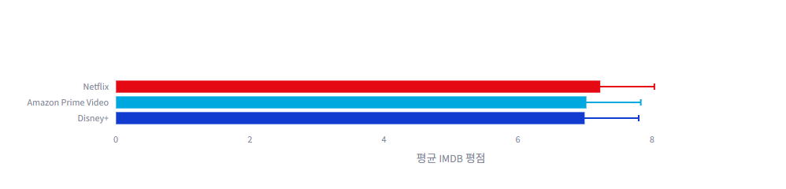

Amazon Prime Video의 평균 평점이 상대적으로 낮다 — 저예산 콘텐츠 포함 비율이 높기 때문으로 해석된다.

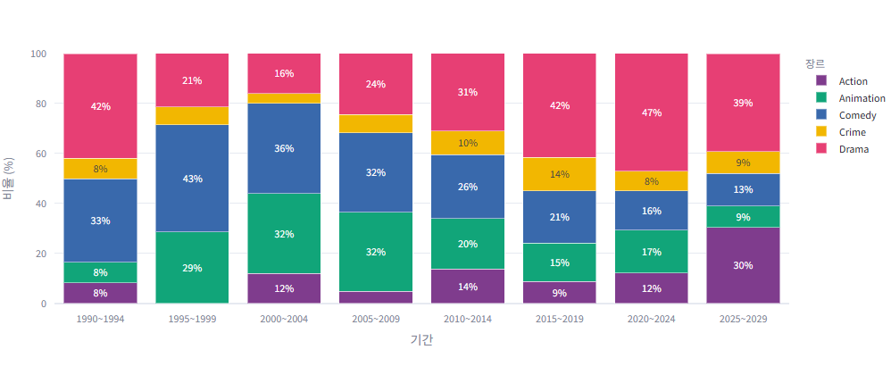

최근 5년간 Drama·Thriller 비중이 전 플랫폼에서 증가했다.

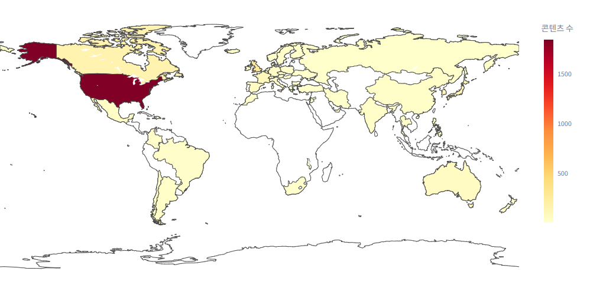

미국이 압도적 1위이며, 한국·일본·인도가 비영어권 국가 중 상위권을 차지한다.

### 5-3. K-콘텐츠 분석

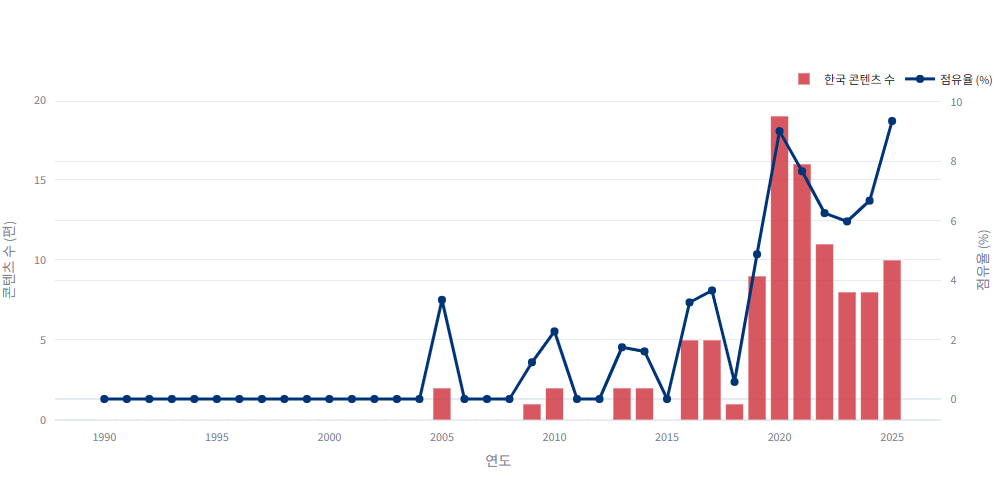

2019년 이후 편수와 점유율이 동반 상승한다. 현재 K-콘텐츠는 전체의 **3.3%(101편)** 를 차지하며 평균 IMDB 평점 **8.11점**으로 글로벌 평균(7.1점)보다 약 1점 높다.

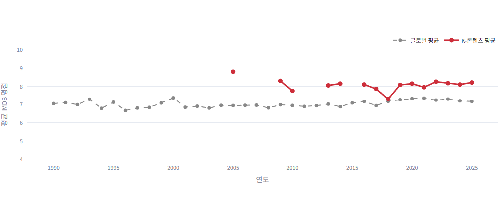

2018년 이후 K-콘텐츠 평점이 글로벌 평균을 꾸준히 웃돌고 있다. '기생충'(2020)·'오징어 게임'(2021)이 변곡점으로 작용했다.

---

## 6. 결론 & 한계

### 핵심 발견

| 번호 | 발견 내용 |
|------|-----------|
| ① | 2015년 이후 TV 시리즈 비중 급증 — OTT 드라마 시리즈 전쟁 데이터로 확인 |
| ② | Disney+는 Animation·Family 중심의 차별화된 IP 전략 일관 유지 |
| ③ | K-콘텐츠: 2019년 이후 편수·점유율·평점 모두 상승 (기생충·오징어 게임이 변곡점) |
| ④ | 콘텐츠 메타데이터만으로 IMDB 평점 예측 가능 — 단, R² 0.385로 설명력은 제한적 |
| ⑤ | 평점은 감독·배우·스토리 등 비정형 요소 의존도가 높아 메타데이터의 한계 존재 |

### 한계 및 향후 과제

| 한계 | 내용 | 개선 방향 |
|------|------|-----------|
| 플랫폼 범위 | Hulu·Apple TV+·HBO Max 미포함 | 추가 플랫폼 크롤링으로 커버리지 확장 |
| 피처 부족 | 예산·제작진·시청 데이터 없음 | 추가 API 또는 공개 데이터셋 결합 |
| 인코딩 한계 | LabelEncoding으로 범주 간 순서 관계 가정 | OneHotEncoding 또는 Target Encoding으로 개선 |